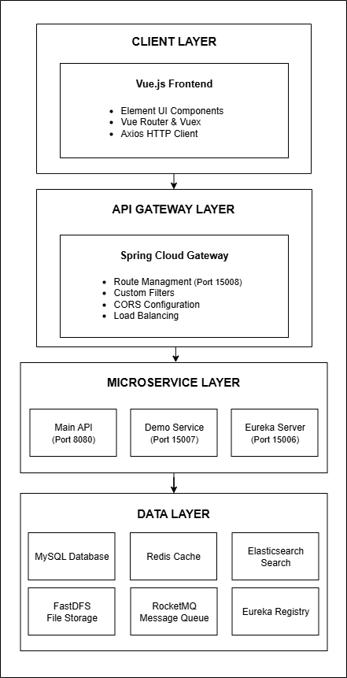

# 🎬 Bilibili-like Video Streaming Platform

A full-stack video streaming platform inspired by Bilibili, built with Spring Boot, featuring user management, video streaming, real-time chat, recommendation engine, and comprehensive DevOps practices.

## Architecture Overview

This project follows a **layered architecture** with clear separation of concerns:



## Technology Stack

### **Backend Technologies**
- **Spring Boot 3** - Main application framework
- **Spring Cloud 2022.0.5** - Microservices support
- **MyBatis 3.5.7** - Object-relational mapping
- **MySQL 8.0** - Primary database
- **Redis 7** - Caching and session management
- **Elasticsearch 8.6.2** - Full-text search
- **RocketMQ 4.9.1** - Message queuing
- **FastDFS** - Distributed file storage
- **WebSocket** - Real-time communication
- **Apache Mahout** - Recommendation algorithms

### **DevOps & Infrastructure**
- **Docker & Docker Compose** - Containerization
- **GitHub Actions** - CI/CD pipeline
- **Nginx** - Load balancing and reverse proxy
- **Maven** - Build automation
- **Make** - Developer tooling

### **Security & Authentication**
- **JWT** - Token-based authentication
- **RSA Encryption** - Password security
- **MD5 Hashing** - Password hashing with salt
- **AOP-based Authorization** - Role-based access control

## Quick Start

### **Prerequisites**
- Java 17+
- Maven 3.6+
- Docker & Docker Compose
- MySQL 8.0
- Redis 7

### **Local Development Setup**

1. **Clone the repository**
```bash
git clone https://github.com/Billy423/Bilibili-like_Video_Streaming_Platform.git && \
   cd Bilibili-like_Video_Streaming_Platform
```

2. **Start external services**

**Option A: Using Docker (Recommended)**
```bash
# Start all services with Docker Compose
docker compose up -d mysql redis elasticsearch rocketmq-nameserver rocketmq-broker

# Or start individual services
docker run -d --name mysql -p 3306:3306 \
    -e MYSQL_ROOT_PASSWORD=114514 \
    -e MYSQL_DATABASE=demo \
    mysql:8.0

docker run -d --name redis -p 6379:6379 redis:7-alpine

docker run -d --name elasticsearch -p 9200:9200 -p 9300:9300 \
    -e "discovery.type=single-node" \
    -e "xpack.security.enabled=false" \
    docker.elastic.co/elasticsearch/elasticsearch:8.6.2
```

**Option B: Local Installation**
```bash
# Install and start MySQL 8.0
# Install and start Redis 7
# Install and start Elasticsearch 8.6.2
# Install and start RocketMQ 4.9.1
```

3. **Configure application properties**
```bash
# Copy and modify the test configuration
cp bilibili-api/src/main/resources/application-test.properties.example \
   bilibili-api/src/main/resources/application-test.properties

# Update database and service URLs in the properties file
```

4. **Build and run the application**
```bash
# Build the project
mvn clean package

# Run with test profile
mvn spring-boot:run -Dspring.profiles.active=test

# Or run the JAR directly
java -jar bilibili-api/target/bilibili-api-*.jar --spring.profiles.active=test
```

### **Containerized Development**

1. **Start the complete stack**
```bash
make dev
# or
docker compose -f docker-compose.yml -f docker-compose.dev.yml up --build
```

2. **Access services**
- **API**: http://localhost:8080
- **Database Admin**: http://localhost:8081 (Adminer)
- **Redis Admin**: http://localhost:8082 (Redis Commander)
- **Elasticsearch**: http://localhost:9100 (ES Head)

## Project Structure

```
bilibili/
├── bilibili-api/                 # API Layer
│   ├── src/main/java/com/example/bilibili/api/
│   │   ├── aspect/              # AOP aspects for security
│   │   ├── config/              # Web configuration
│   │   ├── support/             # User context support
│   │   └── *Api.java            # REST controllers
│   └── src/main/resources/
│       ├── application-*.properties
│       └── mapper/              # MyBatis XML mappers
├── bilibili-service/            # Service Layer
│   ├── src/main/java/com/example/bilibili/service/
│   │   ├── config/              # External service configs
│   │   ├── feign/               # Feign clients
│   │   ├── handler/             # Exception handlers
│   │   ├── util/                # Utility classes
│   │   ├── websocket/           # WebSocket services
│   │   └── *Service.java        # Business logic
│   └── src/main/resources/
│       └── application.properties
├── bilibili-dao/                # Data Access Layer
│   ├── src/main/java/com/example/bilibili/
│   │   ├── dao/                 # DAO interfaces
│   │   └── domain/              # Domain models
│   └── src/main/resources/mapper/
│       └── *.xml                # MyBatis mappers
├── docker/                      # Docker configurations
│   ├── mysql/init/              # Database initialization
│   ├── nginx/                   # Nginx configuration
│   └── rocketmq/                # RocketMQ configuration
├── .github/workflows/           # CI/CD pipeline
├── docker-compose.yml           # Production stack
├── docker-compose.dev.yml       # Development overrides
├── Dockerfile                   # Production container
├── Dockerfile.dev               # Development container
├── Makefile                     # Developer commands
└── README.md                    # This file
```

## Core Features

### **User Management**
- User registration and authentication
- JWT-based session management
- Role-based access control
- User profiles and following system

### **Video Platform**
- Video upload and streaming
- Video interactions (like, collect, comment, coin)
- Real-time danmu (bullet comments)
- Video recommendations using collaborative filtering

### **Search & Discovery**
- Full-text search across videos and users
- Elasticsearch-powered search with highlighting
- Multiple sorting options
- Search result caching

### **Real-time Features**
- WebSocket-based real-time communication
- Live danmu system
- Real-time view count updates
- Instant notifications

### **Recommendation Engine**
- User-based collaborative filtering
- Item-based collaborative filtering
- Apache Mahout implementation
- Fallback to popular content

## Development Commands

```bash
# Build the application
make build

# Run tests
make test

# Start development environment
make dev

# Start production environment
make prod

# View logs
make logs

# Clean up
make clean-docker

# Database shell
make db-shell

# Redis CLI
make redis-cli
```

## Deployment

### **Production Deployment**
```bash
# Build and start production stack
make prod

# Scale services
docker compose up --scale bilibili-api=3 -d
```

### **CI/CD Pipeline**
The project includes automated CI/CD with GitHub Actions:
- **Testing**: Automated unit and integration tests
- **Building**: Docker image creation and publishing
- **Deployment**: Automated deployment to staging

## Monitoring & Health Checks

- **Application Health**: `/actuator/health`
- **Metrics**: `/actuator/metrics`
- **Prometheus**: `/actuator/prometheus`
- **Service Health**: Built-in Docker health checks

## Security Features

- **Authentication**: JWT tokens with refresh mechanism
- **Authorization**: Role-based access control with AOP
- **Password Security**: RSA encryption + MD5 hashing
- **Rate Limiting**: API rate limiting and abuse prevention
- **Input Validation**: Comprehensive input validation
- **Security Headers**: XSS, CSRF, and other security headers

## Interview Highlights

This project demonstrates:
- **Full-stack development** with modern Java technologies
- **Microservices architecture** with Spring Cloud
- **DevOps practices** with Docker and CI/CD
- **Real-time features** with WebSocket
- **Search capabilities** with Elasticsearch
- **Recommendation algorithms** with machine learning
- **Security best practices** with JWT and encryption
- **Scalable architecture** with containerization

## Contributing

1. Fork the repository
2. Create a feature branch
3. Make your changes
4. Add tests
5. Submit a pull request

## Acknowledgments

- Inspired by Bilibili's video streaming platform
- Built with Spring Boot and modern Java ecosystem
- Uses Apache Mahout for recommendation algorithms
- Integrates with Elasticsearch for search capabilities

---

**Built with ❤️ for learning and portfolio showcase**